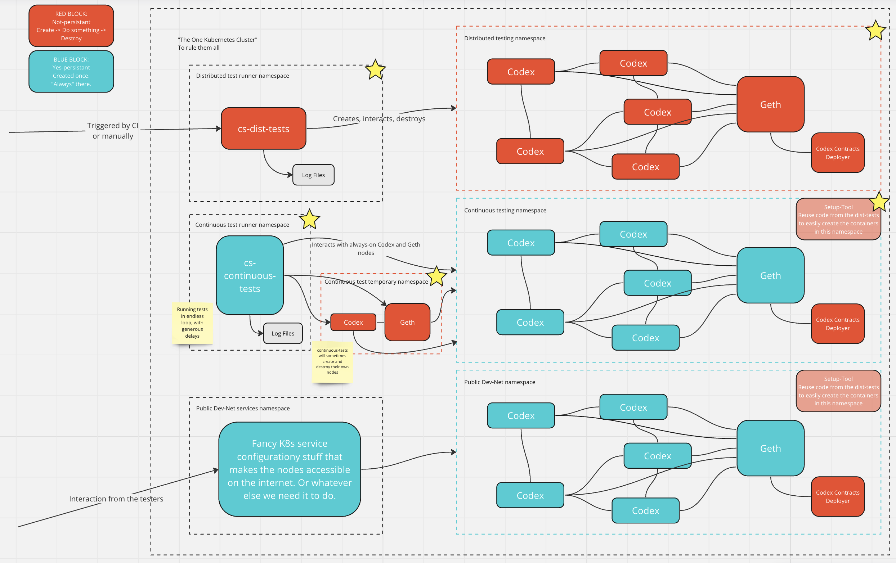

# Tests automation

 1. [Description](#description)
 2. [Architecture](#architecture)
 3. [Run on remote cluster](#run-on-remote-cluster)
    - [Kubernetes cluster pre-configuration](#kubernetes-cluster-pre-configuration)
    - [Run tests manually](#run-tests-manually)
    - [Run tests automatically](#run-tests-automatically)
    - [Tests logs](#tests-logs)


## Description

 The goal of [Distributed System Tests for Nim-Codex](../../) is to test how [Codex](https://codex.storage) works in different topologies in the distributed network and to be able to detect regressions during development.

 We can [run Tests locally](LOCALSETUP.md) and it works well, but in order to scale that we may need to run Tests in an automatic way using remote Kubernetes cluster.

 Initially, we are considering to run dist-tests on [nim-codex](https://github.com/codex-storage/nim-codex) master branch merge, to be able to determine regressions. And we also working on [Continuous Tests](Continuous-Tests.md) which are called to detect issues on continuous Codex runs.


## Architecture



```
                                        Vector --> Elaticsearch --> Kibana
                                      / (Logs)         |
GitHub --> CI --> Kubernetes -->  Job                  |
      \             /                 \                |
        -----------                     Prometheus --> Grafana
                                        (Metrics)
```
 1. GitHub Actions run a workflow
 2. This workflow create a Job in Kubernetes cluster
 3. Job run Dist-Tests runner Pod with specified parameters
 4. Dists-Tests runner run the tests from inside the Kubernetes and generate the logs
 5. Vector ship the logs of the Dists-Tests Pods
 6. Prometheus collect the metrics of the Dists-Tests Codex Pods
 7. We can see the status of the Dist-Test


### Components

| Component                               | Description                             |
| --------------------------------------- | --------------------------------------- |
| [cs-codex-dist-tests](/)                | Distributed System Tests                |
| [Kubernetes](https://kubernetes.io)     | Environment where we run Tests          |
| [Vector](https://vector.dev)            | Ship logs to the Elasticsearch          |
| [Elasticsearch](https://www.elastic.co) | Store and index logs                    |
| [Kibana](https://www.elastic.co)        | Discover the logs in Elasticsearch      |
| [Grafana](https://grafana.com)          | Visualize tests run results and metrics |
| [Prometheus](https://prometheus.io)     | Collect and store metrics               |

> Note: These components are not mentioned on the diagram and provided to understand what do we have under the hood


## Run on remote cluster

 In case of local run we use [Docker Desktop Kubernetes cluster](https://docs.docker.com/desktop/kubernetes/) and during the services checks, app connect directly to the cluster worker nodes and perform ports check. And in case of remote cluster, it would be required to configure services ports exposing using Ingress Controller or run tests directly inside the cluster.

 Now, we have a configuration key `RUNNERLOCATION` which change the logic of the services ports check and when we run tests inside remote cluster we should set it to the `InternalToCluster`.

 As for now, it was decided to run tests inside the remote Kubernetes cluster using CI because
 - Stable connection from app to the Kubernetes API
 - Independence from the CI limitations for long runs
 - Easy, fast, configurable and detachable run

 Because tests are run on remote cluster we need a way to see their execution status and to analyze the logs as well. For that we use Elasticsearch, Kibana and Grafana with logs shipped by Vector. Please see [Tests logs](#tests-logs) for more information.

 Now we can [Run tests manually](#run-tests-manually) and [Run tests automatically](#run-tests-automatically) on [remote Kubernetes cluster which requires to be pre-configured](#kubernetes-cluster-pre-configuration).


### Kubernetes cluster pre-configuration

 Before running the tests on remote Kubernetes cluster we performed [manual pre-configuration](../../../issues/7) and it was require to
 1. [Create a namespace](../../../issues/7)
 2. [Create kubeconfig for App](../../../issues/21)
 3. [Create a secret with created kubeconfig](../../../issues/21)
 4. [Create kubeconfig for GitHub Actions](../../../issues/19)


### Run tests manually

 **To run tests manually we have the following requirements**
 1. Get kubeconfig - to access the cluster
 2. Install [kubectl](https://kubernetes.io/docs/tasks/tools/) - to create resources in the cluster
 3. Install [OpenLens](https://github.com/MuhammedKalkan/OpenLens) - to browse cluster resources

 **And to run the tests we should perform the following steps**
 1. Create a Pod in the cluster, in the `default` namespace and consider to use your own value for `metadata.name`
    <details>
    <summary>pod.yaml</summary>

    ```yaml
    ---
    apiVersion: v1
    kind: Pod
    metadata:
      name: dist-tests-runner
      namespace: default
      labels:
        app: dist-tests-runner
        launched: manually
    spec:
      containers:
      - name: dotnet
        image: mcr.microsoft.com/dotnet/sdk:7.0
        env:
        - name: RUNNERLOCATION
          value: InternalToCluster
        - name: KUBECONFIG
          value: /opt/kubeconfig.yaml
        command: ["sleep", "infinity"]
        volumeMounts:
        - name: kubeconfig
          mountPath: /opt/kubeconfig.yaml
          subPath: kubeconfig.yaml
        - name: logs
          mountPath: /var/log/cs-codex-dist-tests
      restartPolicy: Never
      volumes:
        - name: kubeconfig
          secret:
            secretName: cs-codex-dist-tests-app-kubeconfig
        - name: logs
          hostPath:
            path: /var/log/cs-codex-dist-tests
    ```
    </details>

    ```shell
    kubectl apply -f pod.yaml
    ```

 2. Exec into the Pod using the name you set in the previous step
    ```shell
    # kubectl
    kubectl exec -it dist-tests-runner -- bash

    # OpenLens
    OpenLens --> Pods --> dist-tests-runner --> "Press on it" --> Pod Shell
    ```

 3. Clone dist-tests repository
    ```shell
    folder="/opt/dist-tests"

    git clone https://github.com/codex-storage/cs-codex-dist-tests.git $folder
    cd $folder
    ```

 4. Define variables - optional
    ```shell
    # RUNNERLOCATION                              # defined at Pod creation
    # KUBECONFIG                                  # defined at Pod creation
    export LOGPATH="/var/log/cs-codex-dist-tests" # Logs from that location will be send in Elasticsearch
    export RUNID=$(date +%Y%m%d-%H%M%S)           # Run ID to show in Kibana/Grafana
    export TESTID=$(git rev-parse --short HEAD)   # Test ID to show in Kibana/Grafana
    ```

 5. Run tests
    ```shell
    # All tests
    dotnet test

    # Short tests
    dotnet test Tests

    # Long tests
    dotnet test LongTests

    # Specific test
    dotnet test --filter=CodexLogExample
    ```

 6. We can see in OpenLens Pods started by dist-tests app

 7. If we set `LOGPATH` to a location specified above, we should be able to see tests execution status in Kibana/Grafana. For more information, please see [Tests logs](#tests-logs).


### Run tests automatically

 Now we use GitHub Actions to trigger dist-tests run manually and considering to run them on [nim-codex](https://github.com/codex-storage/nim-codex) master branch merge.

 **It works in the following way**
 1. Github Actions secrets contains [kubeconfig to interact with the Kubernetes cluster](../../../issues/19).
 2. GitHub Actions [workflow](../../../actions/workflows/dist-tests.yaml) uses kubectl to create Kubernetes Job based on the [job.yaml](/docker/job.yaml) manifest file. It also accept optional inputs at run
    - `source`     - Dist-tests source repository
    - `branch`     - Repository branch
    - `namespace`  - Namespace where Dist-test runner will de created
    - `nameprefix` - Dist-test runner name prefix

 3. Kubernetes Job will run the Pod with a custom [Docker image](/docker/Dockerfile) - [codexstorage/cs-codex-dist-tests](https://hub.docker.com/r/codexstorage/cs-codex-dist-tests/tags).  
  Image [entrypoint](/docker/docker-entrypoint.sh) is customizable and we can pass the following variables
    - `SOURCE` - Dist-tests source repository, useful when we work with forks - `default="current repository"`
    - `BRANCH` - Repository branch, useful when we would like to run tests from the custom branch - `default="master"`
    - `FOLDER` - Where to clone repository and it is done just to organize the things - `default="/opt/dist-tests"`

    > **Note:** Variables `SOURCE` and `BRANCH` passed by GitHub Actions to the Kubernetes Job and then to the Pod.

 4. Job manifest is setting all required variables which are part of the Pod run
    ```shell
    RUNNERLOCATION=InternalToCluster
    KUBECONFIG=/opt/kubeconfig.yaml
    LOGPATH=/var/log/cs-codex-dist-tests
    NAMESPACE=default
    SOURCE=current repository
    BRANCH=master
    RUNID=datetime
    TESTID=short sha
    ```

 5. Dist-tests runner will use [kubeconfig to interact with the Kubernetes and run the tests](../../../issues/21), which is set by `KUBECONFIG` variable.

 6. Runner will execute all tests and will write the logs to the `/var/log/cs-codex-dist-tests` folder.

 7. Kubernetes Job status will be changed from `Running` to the `Completed` or `Failed`.

 8. Vector will ship the logs to the Elasticsearch.

 9. We can check execution status in Kibana and Grafana. For more information, please see [Tests logs](#tests-logs).


### Tests logs

 > **Note:** This part is not finished yet and it is under development

 We use Elasticsearch to store and discover the logs of the tests execution and Codex Pods which are run during the tests.

 We can use [Kibana](#kibana) to discover all the logs and [Grafana](#grafana) to see tests execution status.


#### Endpoints

 | App     | URL                                                                          | Authentication |
 | ------- | ---------------------------------------------------------------------------- | -------------- |
 | Kibana  | [kibana.dist-tests.codex.storage](https://kibana.dist-tests.codex.storage)   | GitHub account |
 | Grafana | [grafana.dist-tests.codex.storage](https://grafana.dist-tests.codex.storage) | GitHub account |


#### Kibana

 As for now, we have the following indices in Kibana
 | # | Index Pattern              | Description                         |
 | - | -------------------------- | ----------------------------------- |
 | 1 | `dist-tests-status*`       | Dist-tests execution status logs    |
 | 2 | `dist-tests-logs*`         | Dist-tests logs collected by runner |
 | 3 | `dist-tests-pods*`         | Dist-tests Pods logs                |
 | 4 | `continuous-tests-status*` | Dist-tests execution status logs    |
 | 5 | `continuous-tests-logs*`   | Dist-tests logs collected by runner |
 | 6 | `continuous-tests-pods*`   | Dist-tests Pods logs                |
 | 7 | `kubernetes*`              | All Kubernetes Pods logs            |


#### Grafana

 As for now, we have the following Dashboards in Grafana
 | # | Dashboard                  |
 | - | -------------------------- |
 | 1 | Distributed Tests - Status |
 | 2 | Continuous Tests - Status  |
