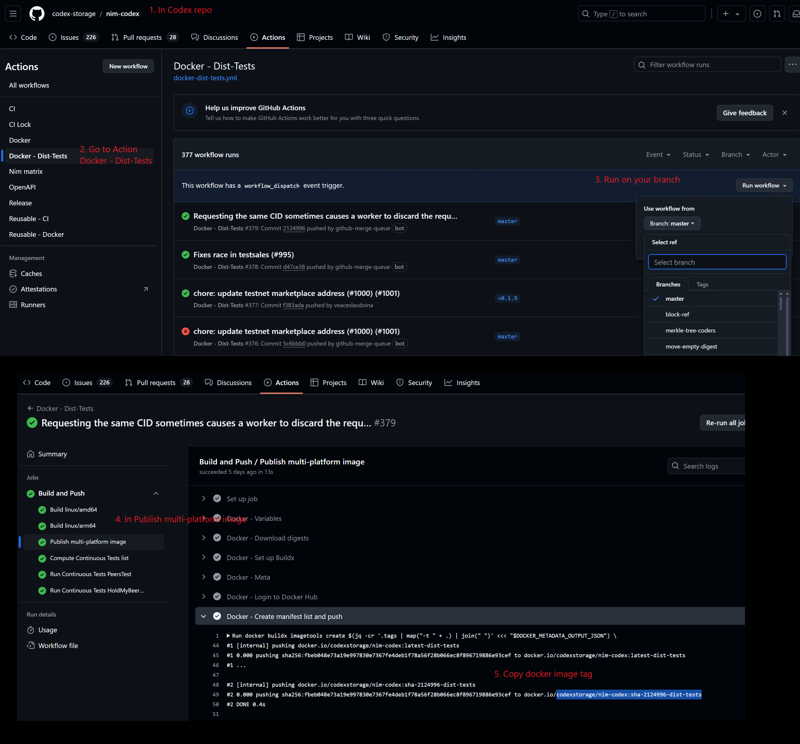
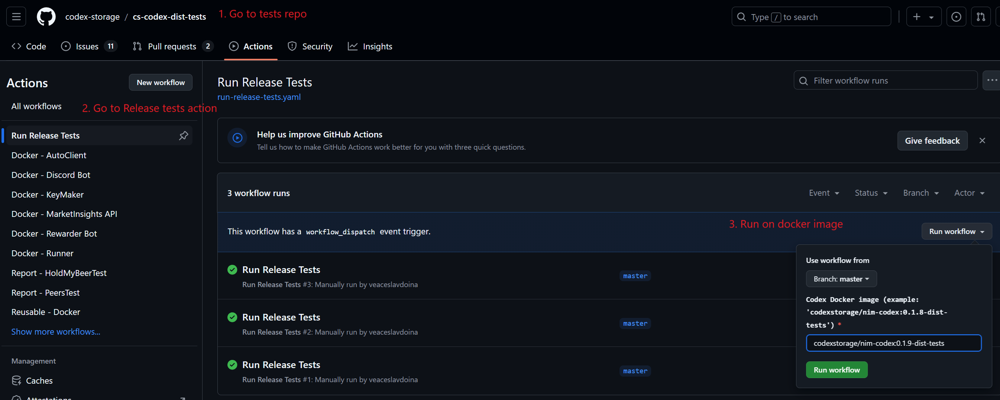

# Codex Tests - How To
Follow these steps to run the distributed tests for Codex. These tests should pass for any (future) release of Codex.

## Build a docker image.
If you already have a dist-tests compatible docker image, skip this step.

## Run tests.

